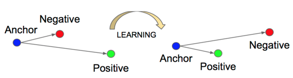
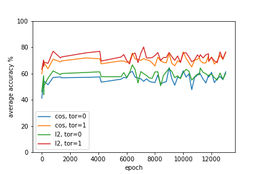

# Reproducing *Time-Contrastive Networks: Self-Supervised Learning from Video*
**Authors:** Max Waterhout (5384907), Amos Yususf (4361504), Tingyu Zhang ()
***
In this blog post, we present the results of our attempted replication and study of the 2018 paper by Pierre Sermanet et al. 
*Time-Contrastive Networks: Self-Supervised Learning from Video* [[1]](#1). This work is part of the CS4245 Seminar Computer Vision
by Deep Learning course 2021/2022 at TU Delft. This whole reproduction is done from scratch and can be found in our github: https://github.com/maxiew123/TCN_self_supervised_learning/tree/main

***
***

## 1. Introduction
In the computer vision domain, deep neural networks have been successful on a big range of tasks where labels can easily be specified by humans, like object detection and segmentation. A bigger challenge lies in applications that are difficult to label, like in the robotics domain. An example would be labeling a pouring task. How can a robot understand what important properties are while neglecting setting changes? Ideally, a robot in the real world can learn a pouring task purely from observation and understanding how to imitate this behavior directly. In this reproduction, we train a network on a pouring task that tries to learn the important features like the pose and the amount of liquid in the cup while being viewpoint and setting invariant. This pouring task is learned through the use of supervised learning and representation learning. In the following, we will provide a motivation for this paper, our implementation of the model, the results that we achieved against the benchmarks and lastly we discuss the limitations of our implementation. 

  
<em>fig 1. An example sequence of a pouring task</em>

## 2. Motivation
Imitation learning has already been used for learning robotic skills from demonstrations [[2]](#2) and can be split into two areas: behavioral cloning and inverse reinforcement learning. The main disadvantage of these methods is the need for a demonstration in the same context as the learner. This does not scale well with different contexts, like a changing viewpoint or an agent with a different model. In this paper, a Time-Contrastive Network (TCN) is trained on demonstrations that are diverse in embodiments, objects and backgrounds. This allows the TCN to learn the best pouring representation without labels. Eventually with this representation a robot can use this as a reward function. The robot can learn to link its images to the corresponding motor commands using reinforcement learning or another method. In our blog, we do not cover the reinforcement learning part.

## 3. Implementation
For our implementation of the TCN we only use the data of the single-view data. The input of the TCN is a sequence of preprocessed 360x640 frames. In total 11 sequences of around 5 seconds (40 frames) are used for training. The framework contains a deep network that outputs a 32-dimensional embedding vector, see fig [1].  

  
<em>Fig. 1: The single-view TCN</em>

### 3.1 Training
The loss is calculated with a triplet loss [[3]](#3). The formula and an illustration can be seen in fig [2]. This loss is calculated with an anchor, positive and negative frame. For every frame in a sequence, The TCN encourages the anchor and positive to be close in embedding space while distancing itself from the negative frame. This way the network learns what is common between the anchor and positive frame and different from the negative frame. In our case the negative margin range is 0.2 seconds (one frame) and negatives always come from the same sequence as the positive. \

  

  
<em>Fig. 2: The triplet loss</em>

The main purpose of the triplet loss is to learn representations without labels and simultaneously learn meaningful features like pose while being invariant to viewpoint,scale occlusion, background etc.. \ 

## 3.2 Deep network
The deep network is used for feature extraction. This framework is derived from an Inception architecture initialized with ImageNet pre-trained weights. The architecture is up until the "Mixed-5D" layer followed by two 2 convolutional layers, a spatial softmax layer and a fully connected layer. 

## 3. Results
For the results we used accuracy measured by video allignment. The allignment captures how well a model can allign a video. The allignment metrics that are used are the L2 norm and the cosine simularity. The metric matches the nearest neighbors, in embedding space, with eachother. In this way, for each frame the most semantically similar frame is returned. We state that a true positive is when a frame lies in the positive range from eachother. This way frame sequence: [1,2] gives the same accuracy as [2,1]. /
We compare our results against the pre-trained Inception-ImageNet model [[4]](#4). We use the 2048D output vector of the last layer before the classifier as a baseline. 

### 3.1 Final result overview
Model is trained on the Google Cloud with one P100 GPU. SGD, SGD with momentum, and Adam were used during different training epochs. Between 1 to 800 epochs, the optimizer was the SGD and between 800 to 4200 epochs, we switched the optimizer to SGD with momentum because the improvement on the loss was slow. After 4200 epochs, we used Adam as the optimizer for the same reason. During the training, single view dataset was used and there were total of 17 videos (fake pouring videos were not used). Each video lasts 7 seconds and contains scenes of pouring taking from the front view. 11 videos were used as training dataset and the rest were for testing. Because there was no validation set to select the best training model, we only saved models for every 200 epochs and for models that had the new minimum losses. In the end, we trained the model for 13k iterations and the training loss is shown in Figure 1. The zigzaging behaviour is due to the 200 epoch gap as well as the missing data betweening 2000 to 6000 epochs after one virtual machine crash.   

  
<em>Fig. 3: The training loss</em>

  
<em>Fig. 4: The testing accuracy</em>

The alignment accuracy from each saved network model for the testing set is ploted in figure 2. Various criterion were used to measure the similarity between two embedded frames, such as consine similarity and euclidean distance (l2). We paid more focus on the l2 distance with one frame tolerence because this setup is closely related to the training procedure.  
The best accuracy measured by that criteria is from the model at the 7200th iteration. The average alignment accuracy is 80.11 percent whereas the Baseline method has an average accuracy of 71.04 percent. 

  
<em>Fig. 5: Overview</em>

https://user-images.githubusercontent.com/99979529/171060214-c9998001-4c61-43a1-82c8-dca6ab182bcd.mp4

### 3.2 Reproduced figure/ table

## 4. Discussion and Limitations

### 4.1 Discussion
### 4.2 Limitations

## References
<a id="1">[1]</a> Sermanet, P., Corey, L., Chebotar Y., Hsu J., Jang E., Schaal S., Levine S., Google Brain (2018). Time-Contrastive Networks: Self-Supervised Learning from Video. <i>University of South California</i>. [https://arxiv.org/abs/1704.06888]() \
<a id="2">[2] </a> J.A. Ijspeert, J. Nakanishi, and S. Schaal. Movement imitation
with nonlinear dynamical systems in humanoid robots. In
ICRA, 2002.
<a id="3">[3] </a> X. Wang and A. Gupta. Unsupervised learning of visual
representations using videos. CoRR, abs/1505.00687, 2015.
<a id="4">[4] </a> J. Deng, W. Dong, R. Socher, L.-J. Li, K. Li, and L. Fei-Fei. ImageNet: A Large-Scale Hierarchical Image Database. In
CVPR, 2009.

