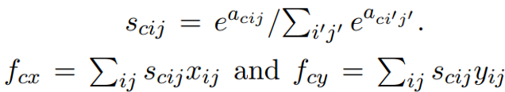

# Reproducing *Time-Contrastive Networks: Self-Supervised Learning from Video*
**Authors:** Max Waterhout (5384907), Amos Yususf (4361504), Tingyu Zhang (5478413)
***
In this blog post, we present the results of our attempted replication and study of the 2018 paper by Pierre Sermanet et al. *Time-Contrastive Networks: Self-Supervised Learning from Video [[1]](#1)*. This work is part of the CS4245 Seminar Computer Vision by Deep Learning course 2021/2022 at TU Delft. This whole reproduction is done from scratch and can be found in our github: https://github.com/maxiew123/TCN_self_supervised_learning/tree/main. The dataset can be found by contacting the authors of the original paper.

***
***

## 1. Introduction
In the computer vision domain, deep neural networks have been successful on a big range of tasks where labels can easily be specified by humans, like object detection and segmentation. A bigger challenge lies in applications that are difficult to label, like in the robotics domain. An example would be labeling a pouring task. How can a robot understand what important properties are, while neglecting setting changes? Ideally, a robot in the real world can learn a pouring task purely from observation and understanding how to imitate this behavior directly. In this reproduction, we train a network on a pouring task that tries to learn the important features like the pose and the amount of liquid in the cup while being viewpoint and setting invariant. This pouring task is learned through the use of supervised learning and representation learning. In the following, we will provide a motivation for this paper, our implementation of the model, the results that we reproduced compared to the performace of the original paper and lastly we discuss the limitations of our implementation.

  
<em>Fig 1. An example sequence of a pouring task [1]</em>

## 2. Motivation
Imitation learning has already been used for learning robotic skills from demonstrations [2] and can be split into two areas: behavioral cloning and inverse reinforcement learning. The main disadvantage of these methods is the need for a demonstration in the same context as the learner. This does not scale well with different contexts, like a changing viewpoint or an agent with a different model. In this paper, a Time-Contrastive Network (TCN) is trained on demonstrations that are diverse in embodiments, objects and backgrounds. This allows the TCN to learn the best pouring representation without labels. Eventually with this representation a robot can use this as a reward function. The robot can learn to link its images to the corresponding motor commands using reinforcement learning or another method. In our reproduction we do not cover the reinforcement learning part of the paper.

## 3. Implementation
For our implementation of the TCN we only use the data from the single-view dataset. The input of the TCN is a sequence of preprocessed 360x640 frames. In total 11 video sequences of around 5 seconds (40 frames) are used for training. The framework contains a deep network that outputs a 32-dimensional embedding representation, see Fig 2.

  
<em>Fig. 2: The single-view TCN [[1]]</em>

### 3.1 Training
The loss is calculated with a triplet loss [[3]](#3). The formula and an illustration can be seen in Fig 3. This loss is calculated with an anchor, positive and negative frame. For every frame in a sequence, the TCN encourages the anchor and positive to be close in embedding space while distancing itself from the negative frame. This way the network learns what is common between the anchor and positive frame and different from the negative frame. In our case the negative margin range is 0.2 seconds (one frame) and negatives always come from the same sequence as the positive.

  

  
<em>Fig. 3: The triplet loss</em>

The main purpose of the triplet loss in this task is to learn representations without labels and simultaneously learn meaningful features like pose, while being invariant to viewpoint, scale occlusion, background etc..

## 3.2 Deep network
The deep network is used for feature extraction. This framework is derived from an Inception architecture (InceptionV3) initialized with ImageNet pre-trained weights. The architecture is copied from InceptionV3, but only until the “Mixed-5D” layer, followed by two 2 convolutional layers, a spatial softmax layer and a fully connected layer. Note that the spatial softmax layer calculates the x and y coordinates multiplied by its softmax score and outputs the maximum activation from each channel. Since the original paper did not give the convolution kernel size, we followed paper [[5]](#5), and used a 5x5 convolution kernel plus ReLu as an activation function.

  
<em>Fig. 4: Spatial Softmax</em>

## 4. Results
For the results we used accuracy measured by video allignment. The allignment captures how well a model can allign a video. The allignment metrics that are used are the L2 norm and the cosine similarity. Note that the distance measurements were calculated on the embedding space. The metric matches the nearest neighbors with each other. In addition, we manually labelled the first frame. In this way, for each frame the most semantically similar frame is returned sequentially. We state that a true positive is when a frame lies in the positive range from the anchor. This way the frame sequence: (1,2) gives the same accuracy as (2,1). We compare our results against the pre-trained Inception-ImageNet model [[4]](#4). We use the 2048D output vector of the last layer before the classifier as a baseline. The same baseline is used in the original paper.

### 4.1 Final result overview
The model is trained on the Google Cloud with one P100 GPU. The optimizers we used are SGD, SGD with momentum, and Adam at different training iterations. Between 1 to 800 iterations, we used SGD, between 800 to 4200 iterations, we switched the optimizer to SGD with momentum because the improvement on the loss was slow. After 4200 iterations, we used Adam as the optimizer for the same reason. During testing 6 video sequences were used, because there was no validation set to select the best training model. We only saved models for every 200 iterations and for models that had the new minimum losses. In the end, we trained the model for 13k iterations and the training loss is shown in Fig [5]. The zigzaging behaviour is due to the saving option every 200 iterations. Furthermore the missing data betweening 2000 to 6000 iterations was caused by a virtual machine crash. 

  
<em>Fig. 5: The training loss</em>

  
<em>Fig. 5: The testing accuracy</em>

The alignment accuracy from each saved model for the testing set can also be seen in Fig [5]. Various criterion were used to measure the similarity between two embedded frames, such as cosine similarity and euclidean distance (L2). We paid more attension to the L2 distance with one frame tolerence because this setup is identical to the training procedure.
The best accuracy measured with this criteria is from the model at the 7200th iteration. The average alignment accuracy is 80.11%. Whereas the baseline method has an average accuracy of 71.04%. In fig [6] we visualize our results from various methods used.

  
<em>Fig. 6: Overview</em>

https://user-images.githubusercontent.com/99979529/171060214-c9998001-4c61-43a1-82c8-dca6ab182bcd.mp4

### 4.2 Reproduced figure/ table
| Method  | Alignment Accuracy (kNN)  | Alignment Accuracy (l2, tor = 1) | Training iteration |
| :------------                  |:---------------:|:---------------:| -----:|
| Baseline                       | 70.2%*           | 71.0%           | -     |
| Random                         |      71.9% *     | -               |      -|
| Single-view TCN (max acc)      | -               |    80.1%        | 7.2k  |
| Single-view TCN (min loss )    | -               |    75.0%        | 11781  |
| Single-view TCN (max itr)      | -               |    76.1%        | 13k   |
| Single-view TCN (literature) [1]| 74.2% *         |    -            |266k   |

In the table above, data with * is from the original paper[1] and the k-neareast neighbour scheme was used for accuracy measurement. However alignment accuracy was measured from L2 distance, since we did not train any classifier for the k-nearest neighbour test. The two accuracy measurements give similar scores for the baseline model namely:70.2% and 71%. Although our training iteration was limited by the hardware, the increment on the accuracy matches with historical data, which means that the model did learn the water pouring representation using the triplet loss. We contribute our higher accuracy results to the small sample size, because the original model was trained on the multi-view dataset. Whereas we only trained the model on the single view dataset.

## 5. Discussion and Limitations

### 5.1 Discussion
We have successfullly been able to reproduce the TCN model on the single-view dataset. The performance of our model is consistent with the results found in the original paper. We used our own evaluation scheme, namely L2, because we believe the evaluation should be similar to triplet loss and we did not train on the multi-view dataset. In future extensions of this reproduction we would advise to train the model on this multi-view dataset as well as reproduce the downstream tasks. 
### 5.2 Limitations
There are a number of limitations for this work, predominantely coming from information that is not explicitly stated in the original paper. Firstly, the code provided by the authors was expired long before the start of this project. Essentially there was a lack of implementation details. Secondly, the preprocessing steps taken for the training data is unknown. For example the mean and standard deviation (STD) for normalization of their model is not provided. Therefore we implemented the identical normalization used for the InceptionV3. In addition the input size was also not provided in the paper, but hidden in the README of the datasets acquired by contacting the authors. Finally, the biggest challenge in our implementation was lack of computing power and/or the financial cost (Google Cloud).

## References
<a id="1">[1]</a> Sermanet, P., Corey, L., Chebotar Y., Hsu J., Jang E., Schaal S., Levine S., Google Brain (2018). Time-Contrastive Networks: Self-Supervised Learning from Video. <i>University of South California</i>. [https://arxiv.org/abs/1704.06888]() \
<a id="2">[2] </a> J.A. Ijspeert, J. Nakanishi, and S. Schaal. Movement imitation
with nonlinear dynamical systems in humanoid robots. In
ICRA, 2002.\
<a id="3">[3] </a> X. Wang and A. Gupta. Unsupervised learning of visual
representations using videos. CoRR, abs/1505.00687, 2015.\
<a id="4">[4] </a> J. Deng, W. Dong, R. Socher, L.-J. Li, K. Li, and L. Fei-Fei. ImageNet: A Large-Scale Hierarchical Image Database. In
CVPR, 2009.\
<a id="5">[5] </a> C. Finn, X. Y. Tan, Y. Duan, T. Darrell, S. Levine, and
P. Abbeel. Learning visual feature spaces for robotic
manipulation with deep spatial autoencoders. CoRR,
abs/1509.06113, 2015.\

